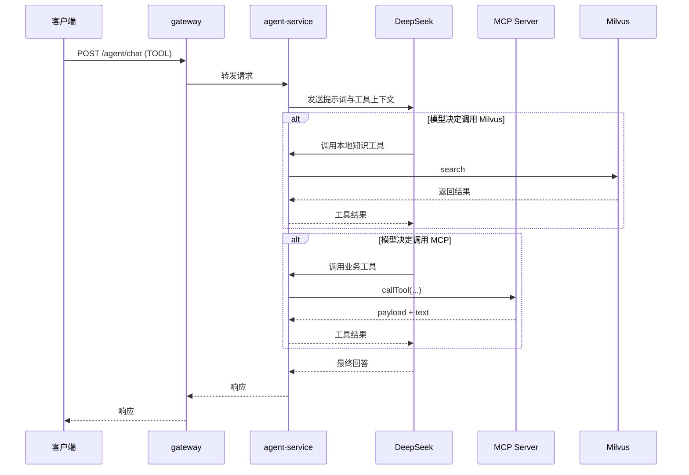
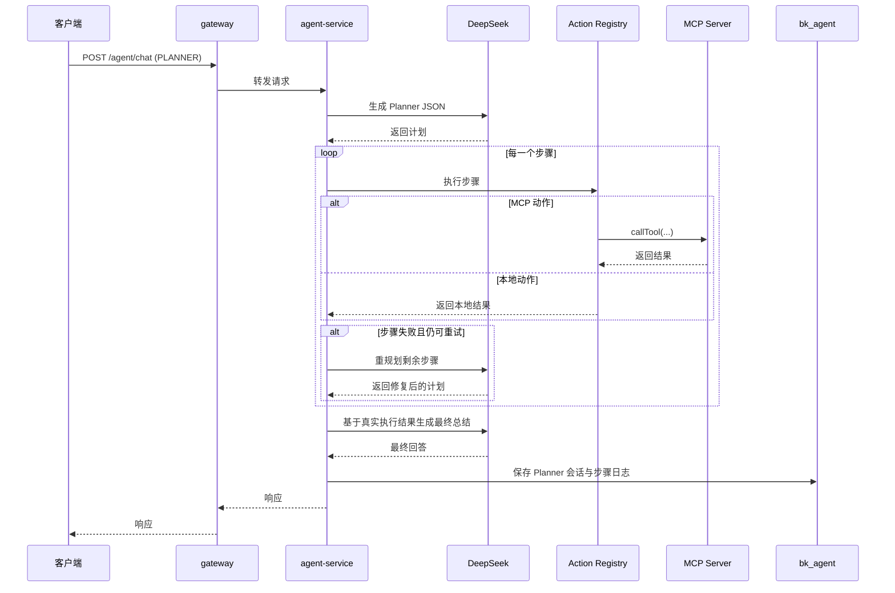

# Agent 服务使用说明

## 1. 接口列表

### 聊天接口

- `POST /agent/chat`

### MCP 工具列表

- `GET /agent/mcp/tools`

### Planner 会话查询

- `GET /agent/planner/sessions/{sessionNo}`

### Milvus 检索

- `GET /agent/vector-store/milvus/search?query=...`

## 2. 聊天请求结构

```json
{
  "message": "帮我分析浦东本月 KPI，并给出改进建议",
  "collectionName": "agent_knowledge",
  "topK": 4,
  "allowMcp": true,
  "executionMode": "TOOL"
}
```

字段说明：

- `message`：用户输入
- `collectionName`：可选，Milvus 集合名
- `topK`：可选，知识检索条数
- `allowMcp`：是否允许 MCP 工具调用
- `executionMode`：执行模式，可选 `TOOL` 或 `PLANNER`

## 3. TOOL 模式示例

请求：

```json
{
  "message": "对比 1 号和 2 号房源，告诉我哪个更适合首次置业",
  "topK": 4,
  "allowMcp": true,
  "executionMode": "TOOL"
}
```

典型行为：

1. DeepSeek 读取用户问题和工具上下文
2. 模型自行判断是否需要调用工具
3. 如果需要，可能调用：
   - Milvus 知识检索
   - 对比 MCP 工具
   - 业务分析 MCP 工具
   - 营销内容 MCP 工具
4. 模型基于真实工具结果直接生成最终回答

典型响应：

```json
{
  "success": true,
  "data": {
    "answer": "1 号房源更适合首次置业，原因是总价更低且通勤更稳定。",
    "model": "deepseek-chat",
    "sessionNo": null,
    "executionMode": "TOOL",
    "decision": {
      "usedKnowledgeTool": false,
      "toolName": "compareListings",
      "toolRequest": "1,2",
      "topK": 4,
      "reason": "Model invoked an external business tool"
    },
    "toolResults": [],
    "toolContext": "..."
  }
}
```

## 4. PLANNER 模式示例

请求：

```json
{
  "message": "先查知识库，再查业务 KPI，最后综合输出门店改进建议",
  "topK": 4,
  "allowMcp": true,
  "executionMode": "PLANNER"
}
```

典型行为：

1. DeepSeek 生成严格的 Planner JSON
2. 执行器按步骤串行运行
3. 每一步调用本地工具或 MCP 工具
4. 某一步失败时可触发重规划
5. 全部执行完成后，再由 DeepSeek 基于真实执行结果生成总结
6. 会话日志可通过 sessionNo 查询

典型响应：

```json
{
  "success": true,
  "data": {
    "answer": "本月门店 KPI 的主要问题在于新增客户不足，建议先提升线索转化。",
    "model": "deepseek-chat",
    "sessionNo": "PLAN-1746940000000",
    "executionMode": "PLANNER",
    "decision": {
      "usedKnowledgeTool": true,
      "toolName": "searchKnowledge",
      "toolRequest": "门店 KPI 改进建议",
      "topK": 4,
      "reason": "Model invoked the Milvus knowledge retrieval tool"
    },
    "toolResults": [],
    "toolContext": "...",
    "plannerSession": {
      "sessionNo": "PLAN-1746940000000",
      "finalPlan": {
        "objective": "完成用户请求",
        "summary": "先查知识库，再查业务 KPI，最后生成总结",
        "steps": []
      },
      "executionResults": [],
      "replanCount": 0,
      "completed": true
    }
  }
}
```

## 5. TOOL 模式时序图



## 6. PLANNER 模式时序图



## 7. Planner 会话查询示例

请求：

```http
GET /agent/planner/sessions/PLAN-1746940000000
```

用途：

- 查看最终生成的 Planner
- 查看每一步执行结果
- 查看重规划次数
- 排查工具调用失败原因
