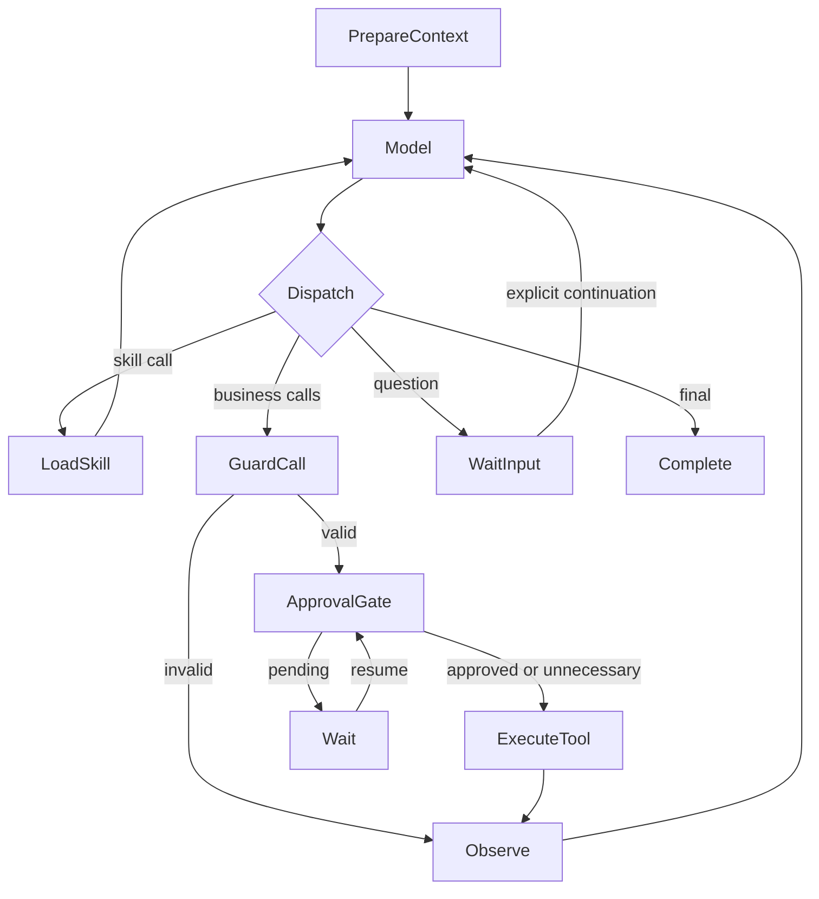

# Design

## Context

最终决策日期：2026-10-04。代码基线为 `dev-fix / 8c980b5`，此前 `8dfa2e9` 只新增规划文档。本版直接修订既有变更，动机见 [proposal.md](proposal.md)。以下新增组件、字段和表均是后续实施内容，本次未修改运行行为。

### 当前实现与改造位置

| 层/位置 | 已观察到的行为 | 最终调整 |
| --- | --- | --- |
| 九个 Subagent 的 `*OfficialA2aAgent` | 基线六个服务有 SkillTool/技能拦截器；compare、trade、marketing 仅有领域 ReAct。实施时已补齐共享组件 | 保留执行模式，补显式选择、版本固定和执行边界 |
| `AgentServiceConfiguration` / 普通 chat | ChatClient 合并本地、静态/动态 MCP 并自动调用工具；没有统一 A2A 模型工具 | 复用能力来源，逐步接入 Supervisor 的同一执行核心 |
| `SupervisorIntentPlanningService` | 默认 llmEnabled=false、rule-first；开启后产出领域 JSON 计划 | 新请求改为单轮模型工具决策，不把开关开启视为完成改造 |
| `OfficialPlanningGraphFactory` | load_session→skill_match→llm_intent_plan→plan_validation→parse_intent→plan_task→select_agent | 新 runner 使用通用模型循环，退出关键词/default intent/默认 Agent 选择 |
| `OfficialSupervisorGraphFactory` | single/parallel/approval 与 nextHint/trade 自动交接 | 复用生命周期、审批、持久化，删除新模式的隐式业务交接 |
| `SupervisorSkillService` / `SkillMatchNode` | 关键词匹配知识技能、注入 skillKnowledge | 知识仅作为背景；接入普通技能目录及模型加载工具 |
| `SkillTool` / `SkillRoutingModelInterceptor` | 正文返回、提示词换装、工具收窄；历史技能可覆盖 hint，缺工具可回退全量 | 复用机制，新增执行级显式策略和快照，严格模式不得扩权回退 |
| `OfficialAgentCardDiscoveryClient` / A2AClient | 卡片转换损失技能/能力信息；agentId 缓存未处理地址变更 | 修目录保真和缓存刷新，保证模型看到的能力可真实调用 |

当前主规格 `supervisor-domain-catalog` 仍要求关键词兜底、领域计划和 nextHint 自动 handoff，本变更 delta 明确替代这些行为。历史未完成变更的相关任务在实施阶段协调，主规格本次不提前同步。

## Goals / Non-Goals

**Goals:**

- Supervisor 对正常请求和指定技能请求都理解用户语义、提取参数、处理信息缺失，再通过真实能力 description/schema 选择调用。
- 模型遵循 skill 正文中的过程说明；平台保证有效能力范围及每次调用治理。新增 Agent/工具/技能不要求新增业务 Graph 节点。
- 复用 Subagent 既有技能 ReAct；同步显式契约、目录描述、版本与恢复，避免扩大领域改造范围。

**Non-Goals:**

- 不实现 DAG、workflow DSL、步骤调度、业务顺序/依赖/完成条件校验，不为每个技能生成子图。
- 不承诺 Markdown 流程严格按顺序执行。顺序与业务结果质量由模型遵循、评估和调优，属于已接受的设计限制。
- 不将所有 Subagent 开放为彼此的全量 A2A 工具，不强制本地工具转 MCP；访谈运行面继续遵守 LR-3/4/5/8/13。
- 本次只写方案；代码、配置、SQL、部署和实现任务均不执行。

## Decisions

### 1. 两种选择来源，同一模型循环

请求内部模式仅有 `AUTO` 与 `EXPLICIT_SKILL`，不存在 SKILL_WORKFLOW 或独立技能执行器。

| 请求 | 首轮前平台动作 | 首轮及后续模型动作 |
| --- | --- | --- |
| 无 skill | 准备授权能力定义与技能 name/description 目录 | 理解请求，直接回答/追问/选择工具，也可主动调用 skill 加载指引 |
| 本次指定 skill | 校验 owner/版本/能力策略，保存快照，加载全文及受限能力定义 | 结合原始请求和正文理解任务、提取参数、处理冲突，逐轮提出调用 |

指定 skill 只免去“选哪个技能”，不免去 LLM 理解。技能名称不存在、跨 owner、版本不支持或能力策略无效时，在业务调用前返回明确错误；缺业务参数或与正文意图冲突时由模型追问/说明，不自动执行、不偷换技能。模型理解不必再成为一个固定领域分类节点，第一轮 Model 就承担这一职责，后续结果也会更新其判断。

拟增补可选顶层字段，字段以各既有 DTO 的实际名称为准：

```json
{
  "sessionId": "session-example",
  "userMessage": "预算三百万，靠近地铁，找房并对比后生成面向首次置业人群的营销草稿",
  "skill": {"name": "listing-compare-marketing", "version": "1"},
  "context": {},
  "stream": true
}
```

不传 skill 为 AUTO；无 version 时接收任务时解析已发布版本并固定内容哈希。选择只作用于本次 run，明确续接才沿用；同会话新请求不从历史 skill 调用恢复旧选择。旧 domain/requireParallel/workflowType 是可解释背景/偏好，不再成为新模式硬路由开关。

为使追问后的续接可实现，拟给现有任务请求增补可选 continueRunId：缺省创建新 run；提供时只能续接同 owner 的 WAITING_USER_INPUT run，按 requestId 去重、租约串行推进，将补充信息追加到原消息并沿用原技能快照。续接保持原 mode、session、allowMcp、请求授权上限与累计预算，执行前仍重验当前权限；新的请求默认值不能扩大原范围或重置预算。AUTO 的动态目录仍按原请求政策与当前权限刷新，并非冻结 Agent 名单。续接不得用新的 skill 改名/换版本；改变任务、技能或请求选项须创建新 run。现有审批回调只处理审批，不能充当用户补充输入接口。任务查询/SSE 增补 WAITING_USER_INPUT 状态，旧字段保留，客户端迁移说明列入发布任务。

### 2. 统一实际可调用的能力目录

新增 `SupervisorCapabilityCatalog` 和 `A2aToolCallbackProvider`。每项具备稳定 capabilityId、无冲突模型名、description、inputSchema、协议、目标、输出摘要和有效版本；模型接口实际 tools 定义绑定执行回调，不只是 prompt 中列名字。

| 能力 | 稳定身份示意 | 实际执行 |
| --- | --- | --- |
| A2A Agent | a2a:listing-agent | 复用 A2aExecutionService 与官方客户端 |
| MCP 工具 | mcp:compare-mcp-server:compareListings | 复用静态/动态 MCP 客户端 |
| 本地能力 | local:searchKnowledge | 对应本地 ToolCallback |
| 技能加载 | 控制工具 skill | 读取发布技能与快照，不执行业务工具 |

首版每个 Agent 一个 A2A 工具，description 包含 Card 描述、技能描述和适用边界；schema 允许 instruction、结构化输入及可选子 skill，目标由回调绑定。模型不能填写地址、认证身份、审批批准结果或全局权限。MCP 名称按连接隔离，修复 putIfAbsent 静默覆盖同名工具；同能力别名应有明确映射，避免重复暴露。

首版使用已授权的真实完整能力目录，不通过业务关键词裁剪。模型每轮使用一致快照；动态增加能力在下一轮/新请求可见，执行前重新验证有效性与权限。冷启动领域词表只能用于诊断，不能生成虚假的可调用 Agent。skill 固定的是逻辑身份与内容版本，不固定实例 IP；同一能力的 endpoint/实例治理可变化，不能自动替换成另一业务 Agent。

### 3. 技能按需加载，流程留在正文

平台 FileLoader/Registry 负责读取文件；LLM 不直接访问磁盘。AUTO 的加载顺序是：目录摘要→模型请求 skill(name,task)→平台加载正文、保存版本快照→下一轮模型结合正文选择业务工具。技能只在成功加载后进入有效状态；失败返回工具错误，不能按尝试调用的名称激活。

显式技能在 PrepareContext 就加载，首轮 Model 已看到正文和有效工具。每轮 Model 都带上原始请求/关联历史、真实工具结果和有效技能；不能只剩技能固定文本而丢掉用户需求。显式策略高于历史激活和 skillHint，后续 skill 工具不能换名、换版本或扩范围。

保留现有 frontmatter+Markdown、description 和 supervisor_skill 知识标记；仅补 owner/version/稳定能力范围。现有非空 tools 列表按所在执行者映射成本地能力允许清单；跨服务技能可使用 capabilities.refs。显式技能必须有非空允许清单，或明确 policy:inherit；inherit 只继承本次身份和请求选项已允许的能力。旧 tools=[] 对旧非显式请求维持兼容，不允许显式模式在解析失败/交集为空时回退全量。

以下是拟发布示范，MCP 引用必须在实施时对照真实 tools/list 校验，工具数据字段也以真实 schema 为准：

```markdown
---
name: listing-compare-marketing
description: 找房、对比候选房源，并生成营销草稿
owner: supervisor
version: "1"
supervisor_skill: false
capabilities:
  policy: allowlist
  refs:
    - a2a:listing-agent
    - mcp:compare-mcp-server:compareListings
    - a2a:marketing-agent
---
# 找房、对比与营销草稿
1. 先理解预算、地段和目标人群；关键信息不足时追问。
2. 委托 listing Agent 找房，使用返回的真实候选数据。
3. 调用对比工具，使用其实际参数 schema，禁止编造房源标识。
4. 将对比结果交给 marketing Agent，说明目标人群并生成草稿。
5. 汇总结果与未解决问题；找不到候选时解释原因，不编造对比结果。
```

这里没有 steps、depends_on、业务条件表达式或参数引用 DSL。模型负责解释文字、构造参数与选择下一次调用；平台不会检测“第 2 步是否完成才允许第 3 步”。本次 explicit 技能的工具集合不能被切换技能扩大；AUTO 的主动技能可按现有浏览机制切换，但始终受请求授权约束和当前技能范围限制。

知识技能仅提供背景，不激活跨服务流程。为延续此前边界，承载跨服务固定过程指引的 Supervisor skill 首版要求用户显式指定，不作为 AUTO 可主动激活目录项；普通专项指引仍可由模型主动加载。二者都使用相同 Markdown 和 Graph，无新增 workflow 类型/执行器。目录标记只控制是否允许自动加载，不决定业务调用。skill 清单、加载工具和执行校验器必须共用这一发布标记，不能只在目录里隐藏。

### 4. Graph 固定通用拓扑，唯一入口执行工具

最终选择在 Supervisor StateGraph 中展开单轮 Model→工具执行循环，不将完整自动执行的 ChatClient/ReactAgent 作为黑盒 Model 节点。新增单轮模型适配层只返回 AssistantMessage/toolCalls；项目 1.1.2.3 下具体调用参数以“没有任何工具副作用”的契约测试确认。执行权属于 ExecuteTool，不能内部先执行、外层再执行一次。Subagent 内部自己的 ReAct 属于被委托的一次 A2A 调用，继续保留。



| 节点 | 允许职责 | 不承担的职责 |
| --- | --- | --- |
| PrepareContext / LoadSkill | 身份、上下文、目录、版本快照、技能加载与范围 | 关键词选域、代替模型理解 |
| Model / Dispatch | 单轮模型输出，按 skill/tool/question/final 结构分派 | 自动执行工具、固定领域计划或业务 if/else |
| GuardCall | 能力、参数 schema、权限、有效技能范围、预算 | 业务步骤顺序、前置结果/必需步骤完成检查 |
| ApprovalGate | 实际调用前审批，绑定 callId 和参数 | 用 skill 正文代替批准 |
| ExecuteTool / Observe | 统一回调分派、账本、实际结果消息 | 自动 nextHint、trade→contract、猜测替代 Agent |
| Complete / Wait | 无待调用/待审批等通用状态检查、保存/等待 | 检查 skill 是否完成了全部文字步骤 |

新增 skill、Agent、MCP 时更新资源或目录，不新增领域节点、分支或业务边。并行仅处理模型同轮提出的独立调用并受容量约束，消费先前结果的调用由模型在后续轮次提出，不建技能依赖引擎。

控制工具 skill/request_input 每轮最多一个且必须单独调用；控制与业务混合、同轮多个控制工具均整批拒绝。每个 toolCallId 都返回未执行结果，不加载正文、不激活技能、不进入等待输入、不触发审批、不执行业务。模型在后续轮次单独提出控制动作，获得结果后再决定业务调用，避免范围与等待状态冲突。

所有工具结果以持久化 toolCallId 对应工具消息回写。追问使用通用控制工具 request_input(question,missingFields) 显式声明，由平台保存工具结果、问题及 WAITING_USER_INPUT 状态；不通过问号、关键词或领域分类判断是否等待。request_input 与 skill 一样不执行业务，不能和业务调用混在同轮；显式技能的业务 allowlist 不屏蔽这个必要控制工具，但不能由控制工具扩大业务范围。模型不提出工具调用而输出最终答复时进入 Complete，仅检查通用待调用/待审批状态。

LLM 失败有界重试，耗尽记录 MODEL_UNAVAILABLE；不切回关键词。nextHints/风险输出仅作为结果建议，只有模型再次提出有效调用才触发下游。

### 5. Subagent 保留现状主体，仅同步契约与约束

| 模块 | 必须调整 | 保留 |
| --- | --- | --- |
| common | 显式技能 DTO、模式/归属/版本/错误码、稳定能力身份 | 领域 DTO 和 RPC |
| common-skill | 首轮显式装载、快照、优先级和双层工具范围校验，Supervisor 可用的目录/加载适配 | Loader/Registry/Watcher、Markdown、SkillTool、非显式 hint/浏览 |
| common-a2a | skillSelection 传递、目标支持版本及本地技能验证、父子调用关联 | 官方 Message/Task/Artifact 和输出规范化 |
| agent-service | 统一目录、A2A 工具、通用 Graph、账本与审批恢复 | MCP 客户端、注册表、任务/SSE/治理基础设施 |
| 九个 Subagent | 接入共享策略，发布 Card skill ID↔本地 name/owner/version 映射 | 已有 ReactAgent、本域工具和业务逻辑 |
| interview-service | 仅治理面契约和卡片核对 | 高频话轮、确定性决策、状态机、脱敏证据域和 MCP 边界 |

A2A metadata 使用可选 `supervisor.skillSelection={name,version,contentHash,mode:"explicit",owner}`。父关联使用 parentRunId/callId/parentSkill，不使用 workflowStepId。父 Supervisor skill 不自动变成子技能；只有模型工具参数明确选择目标本地 skill 时才发送 selection，不能传任意正文代替目标发布内容。无 version/hash 时上游依据目标发布元数据解析身份，下游核验并固定，滚动发布不支持 explicit 的实例明确失败，不能降级成 hint。

优先级为：有效 explicit selection→本次模型主动技能→旧 skillHint→默认本域目录。显式时模型面和实际 ToolCallback 执行面共用范围；不允许历史技能、换技能或工具缺失扩大权限。旧 hint 仍是建议，可被后续模型选择覆盖，遵守 LR-9。本次 run 内的有效正文固定；新的请求不因会话历史继承 explicit。

Subagent 默认不接 Supervisor 全量 A2A 目录；有领域委托需求的服务单独声明 allowlist、调用深度及预算。本方案不把“是否保持本地工具”变成是否支持技能的条件。

### 6. 恢复记录调用事实，不记录业务步骤状态机

checkpoint 存 runnerVersion、mode、messages/toolCallId/results、pendingCalls、effectiveSkillSnapshot/source、目录版本、pendingApproval、等待输入、预算及产物引用。没有 currentStep、stepProgress 或技能流程完成标志；“已调用某工具”属于调用事实，不能据此自动推进文字步骤。

拟增加 `agent_tool_invocation`（runId+callId 唯一）和 `agent_skill_snapshot`（owner/name/version/contentHash）。账本记录能力、规范参数哈希、状态、远端 Task/产物/错误；正文与范围的快照在显式接收或模型成功加载时持久化。两种模式统一使用模型 toolCallId；控制加载调用也保存结果和激活关联。热更新只影响新加载/新 run，恢复使用已有快照。

- 执行前落待调用记录；执行后保存结果和工具消息。重启复用已完成结果，已接受远端 Task 续查；提交结果未知进入 OUTCOME_UNKNOWN，先对账，不盲目重发副作用。
- 稳定子 callId 派生子 A2A task/thread，保留父关联；不能多个调用复用父 taskId 作为子任务标识。
- 审批在真实工具执行前保存 callId/目标/参数哈希；批准后继续原调用，参数改变需重新审批。拒绝/取消终止对应操作，不让模型换别名绕过。待办仍按最新 checkpoint 判断 WAITING_USER_APPROVAL（LR-15）。
- SSE 使用既有事件并补 mode、capabilityId、callId、skill/version；只展示过程摘要和实际结果，不输出隐藏推理，也不伪造完成步骤。
- 账本不能为不支持远端幂等/任务查询的服务提供 exactly-once 保证；无法判定的结果明确等待核对。

### 7. API、动态注册与兼容边界

保留 Supervisor 同步/异步、任务查询、审批回调、产物与 SSE；增补请求级 continueRunId 和待输入状态，明确新请求/原 run 续接的区别。普通 chat 在统一核心稳定后接入并保留响应字段，增补 runId 用于明确续接。allowMcp=false 是执行硬限制，skill 不能覆盖；显式 skill 清单依赖被禁用 MCP 时明确拒绝该选择，不悄悄删工具后继续。

Nacos 继续负责 Agent 注册/发现与 Card/endpoint；MCP 保持现有配置与客户端来源。卡片需保真技能描述/能力；Agent endpoint 变更刷新客户端，不使已关联远端 Task 丢失。当前 Compose 为 Nacos 3.0.3，本地 Starter 用 Agent Registry API；实施前验证部署版本实际支持，必要 HTTP Card fallback 为显式兼容选项，不能伪造发现成功。未连接真实部署环境的版本兼容结论保持 KI-18 待验证。

旧技能资源和提示字段兼容；显式技能的范围策略补齐后才发布为支持 explicit。旧 checkpoint 无新 runnerVersion 时按旧 runner 恢复。新 runner 不读取旧领域计划来决定能力；只有存量任务保留旧路由链。新拓扑和状态必须版本化，不能声称完全无迁移成本。

## Risks / Trade-offs

- [正文顺序不提供强保证] → 用户已选择第一种；规范技能描述、用代表性模型评估观测顺序偏差，不添加隐式步骤校验或把一次样例成功当严格保证。需要强保证的业务不宣称由本方案满足。
- [模型多轮时延/成本和正文理解偏差] → 设置模型/工具预算，记录轮次与结果，调整正文和 description；不通过关键词预选目标优化。
- [目录重名、陈旧或技能缺能力] → 稳定命名空间、逐轮快照、执行前校验、地址失效与明确错误；strict 不能扩权回退。
- [技能更新改变恢复] → 固定正文、范围与身份快照，已激活技能不再次按名称取最新。
- [双重工具执行或审批晚于副作用] → 单轮模型适配只产生调用；Graph 独占 Supervisor 执行入口，增加执行前审批的回归测试。
- [外部副作用与本地存储不原子] → 账本、远端 Task/幂等、未知结果对账；不承诺所有调用 exactly-once。
- [共享库/历史 checkpoint 兼容] → 新字段与支持版本，先服务端后 Supervisor 发布，旧 runner 排空；LR-9/LR-15 和访谈边界不变。
- [Nacos API 版本未实际验证] → 将 Card 注册、endpoint 获取与真实调用的契约冒烟作为发布门禁。

## Migration Plan

1. **能力前置**：卡片保真、地址缓存、MCP 命名和授权目录；验证 Nacos Agent Registry/HTTP fallback，发布技能映射。
2. **共享技能契约**：扩展版本/归属/范围/快照和 explicit selection；先升级九个 Subagent，共用既有 ReAct，保留 hint 和访谈运行面。
3. **Supervisor 通用循环**：单轮 Model、A2A/MCP 回调、GuardCall/审批/账本/Observe、AUTO/EXPLICIT_SKILL；技能加载也回到 Model，不引入第二执行器。
4. **技能示范与入口切换**：发布 Markdown “找房→对比→营销草稿”，进行模型流程遵循评估；迁移普通 chat 与旧 context 行为，明确顺序是模型指引。
5. **存量排空与清理**：旧任务按原 runner 恢复；排空后删除旧关键词/default/自动交接链与死配置。同步本 delta，更新 README、路线图、相交变更与 LR/KI 状态。

回滚：暂停新 run 接收或按 runnerVersion 切回可兼容部署。新调用账本/快照任务保留新 runner 恢复，不能交给旧 runner 或在同一请求中静默降级到关键词路径。

## Acceptance Matrix

| 场景 | 验收结果 |
| --- | --- |
| 无 skill 的问候 | 模型可直接回答，外部调用为 0 |
| 无 skill：“不要发送通知，只分析合同” | 不由关键词调用 notification，真实动作来自模型有效调用 |
| 新领域 Agent 注册，无关键词配置 | 后续目录显示 description/schema，可真实委托，Graph 拓扑不变 |
| AUTO 模型加载普通 skill | 首轮目录摘要，加载成功后下一轮模型看到正文及有效工具 |
| 显式跨服务 skill + 自然语言预算/偏好 | 首轮请求含完整正文和原始需求，模型可提取参数、追问并提出调用 |
| 显式技能未知/版本错/能力或权限缺失 | 业务执行前明确拒绝，不切默认 Agent 或开放全量 |
| 显式技能后换名/越界工具 | 拒绝切换/调用，原版本与范围继续有效 |
| 范围内调用顺序不同于正文 | 程序不因业务步骤顺序拒绝、不自动补步骤；评估记录偏差 |
| LLM 提前结束文字流程 | 无业务步骤完成检查；通用待调用/待审批状态仍正确，评估记录遗漏 |
| skill 加载与业务调用混在同轮 | 整批返回需分轮，不产生业务副作用；后续模型重新决策 |
| 模型追问后补充信息 | request_input 明确进入待输入；continueRunId 续接原 run/快照，跨 owner、重复或状态错误的续接不推进 |
| nextHints=notification.send | 结果建议交给模型，没有额外自动调用 |
| 单轮模型适配/审批暂停 | Model 无工具副作用，未批准动作执行次数为 0 |
| 重启/审批回调重放/远端 Task 已接收 | 复用结果或续查，不重复已完成/已接受的请求 |
| 技能热更新/同会话新请求 | 原 run 用快照；新请求不继承旧 explicit，可用新发布版本 |
| endpoint 改变/MCP 新增或撤销 | 更新真实目录与客户端，调用前验证当前目标，旧远端任务保持关联 |
| 旧 hint/旧 checkpoint/访谈话轮 | 保持各自兼容 runner、建议语义与 LR-3/4/5/8/13 边界 |

验收分两类：确定性测试验证目录、契约、硬范围、Graph/调用/审批恢复；真实模型评估观察正文流程遵循、参数理解和输出质量。后者报告样例、模型版本、偏差和成本，不作为“程序保证技能顺序”的证据。

## Open Questions

- 最大模型轮次、工具预算和并发默认值：用代表性请求测量后确定，支持配置并明确耗尽行为。
- MCP 稳定引用的最终连接名、工具短名和示范输出字段：按真实 tools/list/Card 发布映射，不改变第一种执行语义。
- 实际运维环境使用的 Nacos 支持版本：完成具体 API 契约冒烟后记录版本，不把任意 3.x 视为兼容。
