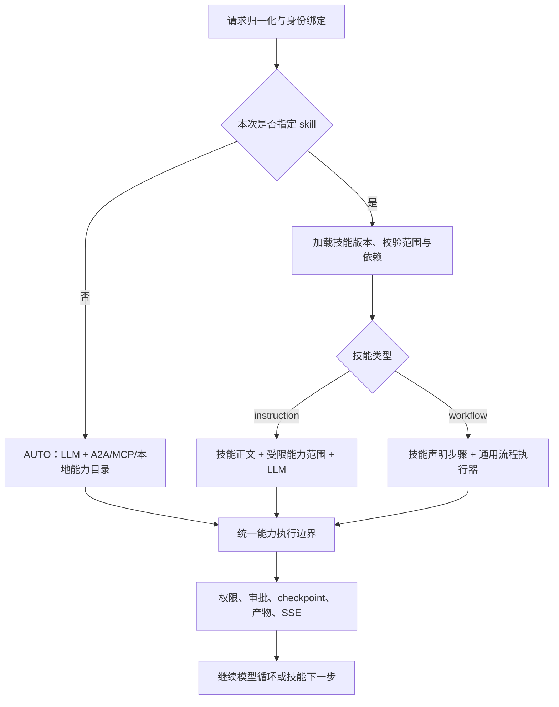

# Design

## Context

基线：`dev-fix / 8c980b5`，2026-10-03。动机见 [proposal.md](proposal.md)。以下组件名称中的“新增”均为拟实现内容，本提交只交付方案。

### 当前实现与偏差

| 现有位置 | 已观察到的行为 | 调整方向 |
| --- | --- | --- |
| `SupervisorIntentPlanningService.tryPlan` | 默认 LLM 关闭；`rule-first` 直接跳过；开启后返回 JSON 领域计划 | 不作为新默认决策核心，替换为模型多轮工具执行 |
| `ParseIntentNode` / `PlanTaskNode` | 关键词选域、默认 listing、领域默认 intent、固定 listing+trade 并行 | 退出新请求入口；业务流程转入显式 workflow skill |
| `SelectAgentNode` / `SupervisorAgentRoutingService` | 计划 ID、灰度首选、领域首项、listing 兜底 | 模型选择稳定能力引用；只保留已选目标的实例/版本治理 |
| `OfficialSupervisorGraphFactory` / `RouteDecisionNode` | 固定 single/parallel/approval 骨架；nextHint 和 trade 结果自动交接 | 保留通用生命周期；删除新模式的隐式业务交接 |
| `AgentServiceConfiguration` / `AgentOrchestratorService` | 普通 chat 已有模型工具调用，合并本地/静态/动态 MCP；无 A2A ToolCallback | 复用能力来源，统一到可持久化的 Supervisor 核心 |
| `SupervisorSkillService` / `SkillMatchNode` | 关键词命中知识技能，注入 `skillKnowledge` | 知识增强不决定 Agent、不选择固定执行流程 |
| `common-skill` | 技能是 frontmatter+正文+本地工具名；无可执行流程；工具缺失可回退全量 | 增加技能类型、稳定能力引用、显式选择与流程步骤；严格模式禁止扩权回退 |
| `SkillRoutingModelInterceptor` / `SkillTool` | 模型可选技能，hint 可预激活，历史技能调用可覆盖 hint | 保留非显式语义；增加独立的本次强制技能策略 |
| `OfficialAgentCardDiscoveryClient` / `OfficialA2aAgentClient` | 卡片转换丢技能、简化能力；客户端按 agentId 缓存 endpoint | 修复目录保真及实例地址变化，作为新能力目录前置条件 |
| `DatabaseCheckpointSaver` / 异步服务 | 已有 DB checkpoint、租约、审批回调和 SSE | 扩展状态结构和调用账本，继续使用既有服务入口 |

主规格 `supervisor-domain-catalog` 的关键词默认分流、nextHint 自动 handoff，以及固定领域计划格式与新目标冲突，必须通过本变更 delta 明确替代。其他未归档变更里的旧规则任务不继续按旧语义实施。

## Goals / Non-Goals

**Goals:**

- 正常请求以可执行 ToolCallback 的 description/schema 驱动模型选择 A2A 或 MCP；允许直接回答、补充信息、多轮调用及显式并行调用。
- 本次指定技能时，技能定义决定有效调用范围；固定跨 Agent/MCP 步骤由技能文件承载，执行器保证顺序、依赖和条件。
- Supervisor 与 Subagent 共享选择、校验、版本和恢复语义，保留已有协议与领域服务。
- 两种路径共享权限、审批、取消、超时、产物、追踪和恢复，不把 LLM 规划结果当作已经发生的执行事实。

**Non-Goals:**

- 本次不实施代码、配置、SQL 或部署，不把现有实现标成已修复。
- 不新建通用 BPM 平台、不引入任意脚本表达式或无限循环 DSL、不让所有 Subagent 相互注册成全网工具。
- 不强制把 Subagent 本地工具改为远程 MCP；不改变 interview 运行面状态所有权、确定性话轮决策和 MCP 公开范围（LR-3/4/5/8/13）。

## Decisions

### 1. 一个执行入口，三种请求模式

新增内部 `ExecutionMode`：`AUTO`、`SKILL_INSTRUCTION`、`SKILL_WORKFLOW`。归一化请求后只依据显式技能选择及技能类型分支：



拟给 Supervisor 同步/异步任务与工作流请求增补可选顶层字段：

```json
{
  "sessionId": "session-example",
  "userMessage": "找合适房源、进行对比并生成营销草稿",
  "skill": {"name": "listing-compare-marketing", "version": "1"},
  "context": {"budget": 3000000},
  "stream": true
}
```

省略 `skill` 即 `AUTO`；指定技能的名称、所属执行者、版本和依赖必须有效。无版本时在本次接收时解析已发布版本并固定内容哈希，后续恢复不能重新取“最新”。`skill` 属于本次 run，后续新请求不继承，除非显式继续该 run。只在 context 里传 `domain`、`requireParallel` 或模型输出含某关键词，不得隐式激活工作流。

兼容入口统一归一化：`/agent/chat` 保留既有响应字段并增补可选 run 标识，内部改用同一执行核心；旧 `allowMcp=false` 继续禁用 MCP。旧 context 路由字段在新模式中作为可解释背景/偏好，不再作为硬路由开关；显式非技能目标不做默认 listing 兜底。兼容影响列入 API 说明，不能静默沿用旧规则。

替代方案：只把 `llm-enabled` 改成 true，仍会保留单域 JSON 计划、固定分支和隐式交接，无法满足本次意图，故不采用。

### 2. A2A 和 MCP 都成为模型可调用能力

新增 `SupervisorCapabilityCatalog` 和 `A2aToolCallbackProvider`，统一能力描述：稳定 `capabilityId`、协议种类、模型工具名、description、inputSchema、输出摘要、目标 Agent/连接、可选技能、版本、健康和权限信息。

- A2A 以每个 Agent 一个可调用工具为首版，例如能力 ID `a2a:listing-agent`、模型名 `a2a__listing_agent`。description 由 Agent Card 描述、skills 的描述和适用边界生成；inputSchema 至少允许任务 instruction、结构化输入及可选下游 `skill`，目标本身由 ToolCallback 绑定。
- MCP 以连接和工具组成稳定身份，如 `mcp:compare-mcp-server:compareListings`，保留工具实际 description/inputSchema；同名工具不能被当前 `putIfAbsent` 合并逻辑悄悄吞掉。
- 必要本地工具使用 `local:<toolName>`；避免同时重复暴露同一能力的多个名称导致模型或技能无法区分。目录同时展示来源、描述及 schema。
- 先使用用户已获授权的完整目录；首版不做关键词裁剪。大目录优化只能增加由模型选择的能力发现工具，不改变 AUTO 的决策归属。
- schema 中禁止模型填写网络地址、认证身份、审批批准结果、全局权限；这些由服务端绑定。description 表示能力事实，不能覆盖平台或用户约束。

每个工具的执行端点都复用治理边界：A2A → `A2aExecutionService` → 官方客户端；MCP → 已有静态/动态 MCP 客户端；本地能力 → 对应本地 ToolCallback。仅把 description 放进 prompt 而没有真实调用适配器不算完成。

目录按版本生成：每次模型调用使用一致的当前快照，进入执行时重新检查目标有效性和权限。动态新增 Agent/MCP 在后续模型轮次或新请求可见。技能固定的是能力逻辑身份与技能版本，不是永久固定实例 IP；相同 Agent 的实例变化可正常治理，业务目标替换必须有技能明确声明或模型重新选择。

### 3. AUTO 采用可恢复的工具调用循环

拟新增 `SupervisorReactAgent` 及运行适配层，复用项目已使用的 Spring AI Alibaba ReactAgent/StateGraph。其流程为“模型 → 0..N 个工具调用 → 结果作为工具消息 → 模型”，模型负责选择对象、生成参数和判断结束；声明了多项独立 tool call 才触发有界并行，依赖步骤在下一轮进行。

外围图只承担通用生命周期：加载上下文/目录 → 模型或技能执行 → 待审批/待输入 → 保存/恢复 → 完成/失败/取消。不再通过 `workflowType` 选择营销或交易业务链。`domain`、`intent` 改为描述调用/观测字段，不是正常执行的必填路由计划。

`nextHints` 保留在结果中供模型参考，不自动触发下游请求；trade 风险结果也交给模型或已指定 skill。预算、权限、审批、schema 校验是硬执行约束，不能被模型省略。LLM 失败可做有界同模式重试，耗尽后记录 MODEL_UNAVAILABLE；模糊任务可返回待输入状态。都不能自动切到关键词路径。

替代方案：自由模式仍生成完整 JSON DAG 后执行。该方案对一次性计划过度依赖，难以基于实际工具结果调整；保留结构化流程给显式 workflow skill，自由模式采用逐轮决定。

### 4. Skill 分类型，固定流程落在技能文件中

扩展共享技能模型和解析器：`kind`（knowledge/instruction/workflow）、`version`、`owner`、description、参数 schema、能力范围和可选 workflow。原 `supervisor_skill: true` 的知识技能映射为 knowledge；普通现有技能默认 instruction。A2A Card 的 skill ID（如 `listing.search`）与本地技能 name（如 `listing-search`）不同，必须发布明确映射，不能通过字符串猜测。

| 类型 | 谁决定调用 | 执行方式 |
| --- | --- | --- |
| knowledge | 原本的模型决策主体 | 只注入知识，不切换 Agent/工作流 |
| instruction | LLM 在技能明确允许的能力内判断 | 注入正文、固定范围；领域技能大多属于此类 |
| workflow | 技能声明固定对象、依赖和条件 | 通用执行器按步骤执行；仅在声明的 `llm` 步骤中使用模型 |

固定流程首版支持有向无环步骤：`a2a`、`mcp`、`local`、`llm`、`approval`；通过 `depends_on`、结果引用和有限的存在/等于/包含条件表达串行、并行、分支。参数字段用输入或先前输出引用，禁止任意脚本；步骤状态记录 pending/running/succeeded/skipped/failed。LLM 只能填充被声明为模型生成的字段，不能更换绑定目标或跳过必做步骤。

下例是新格式的示意，**不是当前解析器已经支持的语法，也不是已发布的技能**。MCP 标识需要在实施时按真实 `tools/list` 校验，Agent 输出引用路径需以实际 DataPart 契约确定：

```yaml
name: listing-compare-marketing
kind: workflow
owner: supervisor
version: "1"
capabilities:
  policy: allowlist
  refs:
    - a2a:listing-agent
    - mcp:compare-mcp-server:compareListings
    - a2a:marketing-agent
workflow:
  steps:
    - id: search
      type: a2a
      target: a2a:listing-agent
      input: {instruction: "按本次预算和偏好寻找房源", context: "${input.context}"}
    - id: compare
      type: mcp
      target: mcp:compare-mcp-server:compareListings
      depends_on: [search]
      input: {listingIds: "${steps.search.output.listingIds}"}
    - id: draft
      type: a2a
      target: a2a:marketing-agent
      depends_on: [compare]
      input: {instruction: "基于对比报告生成营销草稿", context: "${steps.compare.output}"}
```

审批步骤是可用的通用节点，适用动作还必须通过既有平台审批策略；技能未写审批不能绕过工具的审批要求。先做全流程必需依赖预检，缺失依赖即报具体步骤/能力错误，不执行前序副作用、不替换 Agent、不开放全量工具。

显式 instruction 技能必须声明 allowlist，或显式 `policy: inherit`（继承当前权限允许的工具，不是扩大权限）。workflow 技能必须使用可枚举的能力引用。旧技能 `tools: []` 对非显式请求保留兼容语义；迁移为显式技能时必须明确 policy，不能因为解析失败或工具无交集恢复全量。

正常模式下模型仍可主动加载 description 匹配的 instruction 技能辅助执行；这属于模型的主动选择。首版不将 workflow 技能暴露给模型自动激活，固定流程只接受本次显式选择，避免再次发生隐式工作流。

### 5. Subagent 共享契约同步调整，领域执行按需调整

**结论：需要同步，但主要是 common 层、装配和能力描述，不是九个服务全部重写。**

| 层/模块 | 必需改动 | 可复用部分 |
| --- | --- | --- |
| common | 技能选择 DTO、模式、版本、能力引用和错误码；内部请求的可选字段 | 已有业务 DTO、权限/RPC 契约 |
| common-skill | 解析新类型；显式 selection 高于历史 `skill` 调用和 hint；调用边界校验 | 文件加载/外部目录、目录浏览、非显式 SkillTool |
| common-a2a | 校验 A2A metadata、绑定执行级技能策略和输出执行信息 | 官方 Message/Task/Artifact 和输出规范化 |
| 九个 Subagent | 接入共享策略；核对本地 tool name、skill name 和 Card skill ID 映射 | ReactAgent、本服务工具、领域逻辑 |
| 有跨服务需求的个别 Subagent | 配置并暴露其明确需要的 MCP/有限 A2A 能力 | 无需拥有 Supervisor 全量目录 |
| interview-service | 仅治理面技能契约和卡片核对 | 运行面状态机、脱敏/证据规则、只读 MCP 边界 |

A2A metadata 新增可选 `supervisor.skillSelection={name,version,contentHash,mode:"explicit",owner}`；父工作流 lineage 单独放 `workflowSkill`/stepId。父级 Supervisor skill 不自动作为子 Agent skill：只有具体 A2A 步骤或模型工具参数显式声明下游技能才发送 selection。调用方不发送任意技能正文；目标按本地发布技能解析与校验。

优先级：**有效 explicit selection → 本次模型主动激活的 instruction skill → 旧 skillHint → 默认领域能力目录**。显式模式中，后续 SkillTool 不能改名、改变版本或扩工具集，调用执行器也要校验，不能只在模型面隐藏工具。未知技能、跨 owner、版本不符、能力缺失均返回结构化失败；未指定 selection 的旧客户端继续使用原有行为。

LR-9 的 hint 语义不改成强制：仍可提示预激活并被模型覆盖；新的 explicit selection 使用新契约。在具备显式能力的目标上使用新契约前核验支持版本；不支持的旧实例明确报协议能力不支持，不能把 explicit 偷降级为 hint。滚动发布先升级共享库和服务端，再开放 Supervisor 新字段。

为防委托循环，首版 Subagent 默认不装配全量 A2A 工具，跨 Agent 编排归 Supervisor；个别明确需要的委托受 allowlist、深度和总调用预算控制。

### 6. 保留治理能力，恢复粒度下沉到每次调用

执行模式与模型会话：checkpoint 持久化 runnerVersion、mode、模型消息中的 toolCallId/结果、待执行调用、能力快照版本、技能快照引用、当前步骤、待输入/审批和预算。不要把大文件/base64 放进 checkpoint，产物通过现有 artifact ID 引用。

拟新增持久化调用账本 `agent_tool_invocation`（唯一键 runId+callId）和 `agent_skill_snapshot`（内容哈希去重，存版本化技能正文及流程）。调用账本记录能力引用、规范参数摘要/哈希、状态、远端 taskId、产物和错误；skill 快照在接受显式 run 时保存。恢复必须读取固定快照，不靠热更新后的新文件。

- AUTO 的 callId 使用持久化模型 toolCallId；workflow 使用 runId+stepId，合法重生成另有 generation。幂等 key 不因进程重启或传输重试变化。
- 子 A2A task/thread 以每次稳定子调用 ID 标识，与父 taskId 分开，保留 parentTaskId/branchId/traceId，避免多个子调用复用同一个执行上下文。
- 先落待调用记录，再执行，再持久化结果和 tool message；重启遇到已完成记录直接复用。远端 Task 已接收则查询/续接，不能再次提交。
- 调用超时且提交结果未知时进入 OUTCOME_UNKNOWN；只有远端已证明未执行、明确幂等或只读操作才重发。账本与 checkpoint 不能声称为所有外部服务提供 exactly-once。
- 审批在**实际动作执行前**中断，保存 toolCallId、参数哈希/skill step 和 owner；通过后执行该动作，不重新规划已批准参数；参数修改必须重新审批。
- 审批待办查询依旧只根据任务最新 checkpoint 判定 WAITING_USER_APPROVAL（LR-15）；拒绝/取消不能被模型继续绕开。
- SSE 复用现有事件并扩充 mode、capabilityId、callId、skill/version/stepId；内容只展示过程摘要和结果，不采集或输出模型隐藏推理。

### 7. 新旧职责划分与复用清单

| 现有能力 | 新模式处理 |
| --- | --- |
| DynamicAgentRegistry、DomainCatalog | 保留发现、描述和校验；冷启动词表不能生成可调用的假 Agent |
| OfficialA2aAgentClient、A2aExecutionService、输出规范化 | 复用，修能力映射和缓存失效；包装成 A2A ToolCallback |
| DynamicMcpClientManager、MCP ToolCallback | 复用，增加稳定命名、刷新和治理适配 |
| ParseIntent/PlanTask 关键词/defaultIntent | 新请求停用；仅在旧 run 恢复的兼容 runner 中暂留 |
| RouteDecisionNode trade→contract | 从 AUTO 删除；若要固定业务链，在新 workflow skill 声明该条件 |
| nextHints 自动 handoff | 删除新模式自动行为，保留返回字段给模型参考 |
| 灰度治理 | 可以控制新 runner 放量和同一能力的实例版本；不能悄悄改变业务目标 |
| 原营销等 workflowType | 保留历史查询兼容；需要固定过程的请求迁移为显式 skill |
| permission、approval、checkpoint、memory、async、SSE | 复用，补调用级恢复与模式兼容 |

## Risks / Trade-offs

- [模型决策增加时延和成本] → 记录模型轮次/耗时/工具预算，描述精简，首版用已授权完整目录；优化不得恢复关键词业务分流。
- [只靠技能 prompt 无法保证固定流程] → 固定步骤必须结构化，执行器保证 target/依赖，instruction 与 workflow 明确区分。
- [技能升级导致恢复偏移] → 接受请求时固定版本和内容快照；热更新只影响新 run。
- [A2A/MCP 同名或目录陈旧] → 命名空间稳定 ID、快照、调用前重新校验；Agent endpoint 变化重建客户端，卡片技能/能力按真实字段保真。
- [Nacos 版本能力差异] → 当前 Compose 为 3.0.3；本地 Starter 使用 Agent Registry API。实施时选择并验证支持该 API 的服务端版本；HTTP Card fallback 作为显式兼容配置并观测，不伪造卡片。首版发布门禁包含 Agent 注册、卡片、endpoint 与调用的实际契约测试。
- [外部调用和本地落库不原子] → 账本+远端 Task 查询/幂等支持；未知结果先对账，不能保证所有副作用 exactly-once。
- [共享库升级影响九个 Agent] → explicit selection 用新增字段、版本声明和分批发布；旧请求/技能保留兼容，严格策略仅作用于显式模式。
- [既有审批/checkpoint 格式有历史依赖] → 新 runner 状态版本化，并保持 latest-checkpoint 判据；旧 run 由原 runner 恢复。

## Migration Plan

1. **基础能力与契约**：核对真实 Agent Cards、MCP tools/list、权限描述；修卡片保真、endpoint 缓存；实现稳定能力目录。确认 Nacos 部署版本及 HTTP fallback 配置，完成分布式注册契约验证。
2. **共享技能契约**：扩展 common/common-skill/common-a2a，先升级九个 Subagent，发布支持版本和技能映射；保留旧 hint，不改领域运行面。
3. **AUTO 新核心**：A2A ToolCallback 与 MCP 接入同一模型循环，增加账本/checkpoint/审批恢复；以新 runner 放量而不做关键词回退。普通 chat 和 Supervisor 各入口统一归一化。
4. **显式技能执行**：实现 instruction 严格策略及 workflow 通用执行器，迁移一个“找房→对比→营销草稿”技能作为示范；交易风险固定审查流程作为另一份明确可选技能，不默认套用。
5. **切换与收尾**：新请求默认新模式；对旧 `domain`/`requireParallel`/workflowType 行为给迁移说明；旧 checkpoint 保留原 runner，旧 run 清空后删除旧路由节点、配置和死代码。按本 delta 同步主规格，重写 README/路线图和关联变更任务。

回滚方案：未来上线若出问题，可暂停新 run 接收或显式切回部署版本；按 runnerVersion 分别恢复既有 run。已有新技能/调用账本不能由旧 runner 解释，保留可恢复数据并待新 runner 修复，不在同一请求内静默降级成旧关键词流程。

## Acceptance Matrix

| 场景 | 验收结果 |
| --- | --- |
| 无 skill：“不要发送通知，只分析这份合同” | 不因关键词预选 notification，模型选择分析能力且不发送 |
| 无 skill：一般问候 | 可以直接回答，A2A/MCP 调用数为 0 |
| 无 skill：注册新领域 Agent，未配置关键词 | 后续模型目录可见 description/schema，可实际委托 |
| 无 skill：Agent 回 nextHints=notification.send | 只把建议交给模型，平台无额外自动通知调用 |
| 指定 workflow skill | 按声明的 A2A→MCP→A2A 顺序传递实际结果，模型不能更换 target |
| 指定 skill 缺依赖/版本/权限 | 执行前明确拒绝，工具不扩权，Agent 不替换 |
| 显式子技能 + 后续 SkillTool 改名 | 拒绝改名，保留当前技能和调用范围 |
| 仅旧 skillHint | 保持可覆盖的旧行为，未变成强制模式 |
| 审批后重启、重放回调 | 只恢复批准的调用，不重复已完成副作用 |
| 技能热更新后恢复旧任务 | 用原技能快照继续，新任务使用新版本 |
| endpoint 更换/MCP 动态新增或移除 | 更新真实工具目录和客户端，已缺失目标调用前失败 |
| 访谈运行面 | LR-3/4/5/8/13 相关测试和服务边界继续通过 |

## Open Questions

- 生产模型的默认最大轮次、输入/输出预算及并行限额：实施前用代表性请求测量后定值；代码必须支持配置并在耗尽时明确终止。
- 最终模型工具短名称和示范技能输出引用字段：依据真实发现结果确定并发布映射，稳定 capabilityId 和执行语义不受影响。
- Nacos 支持版本的具体部署版本号：在现有运维环境选定并验证；此处只要求实际支持所用 Agent Registry API，不把任意“3.x”视为满足。
